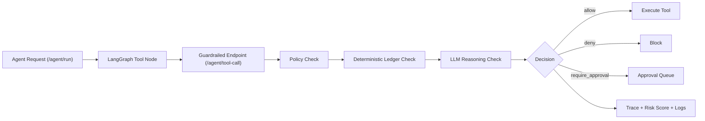

# FinAgentGuard

Guardrails for financial AI agent actions.

I built FinAgentGuard to protect high-risk agent actions (refunds, routing, disputes, reconciliation) using:
- deterministic ledger checks
- policy-based financial rules
- LLM reasoning validation
- full decision traces with risk scoring

## Why This Project

A single hallucinated tool call in payments can trigger real money loss.

The system answers one question:
**Should this agent action execute, be blocked, or require approval?**

## Architecture



## Tech Stack

- Python
- FastAPI
- Pydantic
- LangGraph
- OpenAI / Anthropic APIs
- Streamlit
- Pytest

## Project Structure

```text
app/
  main.py
  middleware.py
  guarded_runner.py
  policy_engine.py
  validators.py
  ledger.py
  schemas.py
  rules.yaml
dashboard/
  app.py
simulations/
  scenarios.json
  replay.py
tests/
  test_policy.py
  test_validators.py
  test_guarded_runner.py
```

## Quickstart

```powershell
cd "E:\I Solved It\FinAgentGuard"
python -m venv .venv
.\.venv\Scripts\Activate.ps1
pip install -r requirements.txt
```

If you do not use `requirements.txt`, install dependencies manually:

```powershell
pip install fastapi uvicorn pydantic pydantic-settings sqlalchemy httpx pytest pytest-asyncio streamlit langgraph openai anthropic python-dotenv
```

Run API:

```powershell
.\.venv\Scripts\uvicorn.exe app.main:app --reload
```

Run dashboard:

```powershell
.\.venv\Scripts\streamlit.exe run dashboard\app.py
```

## Simulation Replay (330 scenarios)

Run adversarial replay:

```powershell
.\.venv\Scripts\python.exe simulations\replay.py
```

Current replay output:

```text
Scenarios replayed: 330
Unsafe block rate: 100.00%
False positive rate: 0.00%
Hallucination detection rate: 100.00%
Expected outcome pass rate: 330/330
```

Artifacts:
- `simulations/last_report.json`
- `simulations/last_outcomes.json`
- `logs/guardrail_decisions.jsonl`

## Testing

```powershell
.\.venv\Scripts\pytest.exe -q
```

## API Endpoints

- `GET /health`
- `POST /agent/tool-call` (guardrailed execution endpoint)
- `POST /agent/run` (LangGraph path that routes through guardrails)

## Demo Script

1. Send a safe refund request and show execution.
2. Send a hallucinated refund request and show block with rule + trace.
3. Send a dispute accept action and show approval-required status.
4. Run replay and open Streamlit dashboard for metrics + decision inspector.

## Project Line

**FinAgentGuard - a guardrail layer for payment agents where hallucinated tool calls can cost real money.**
